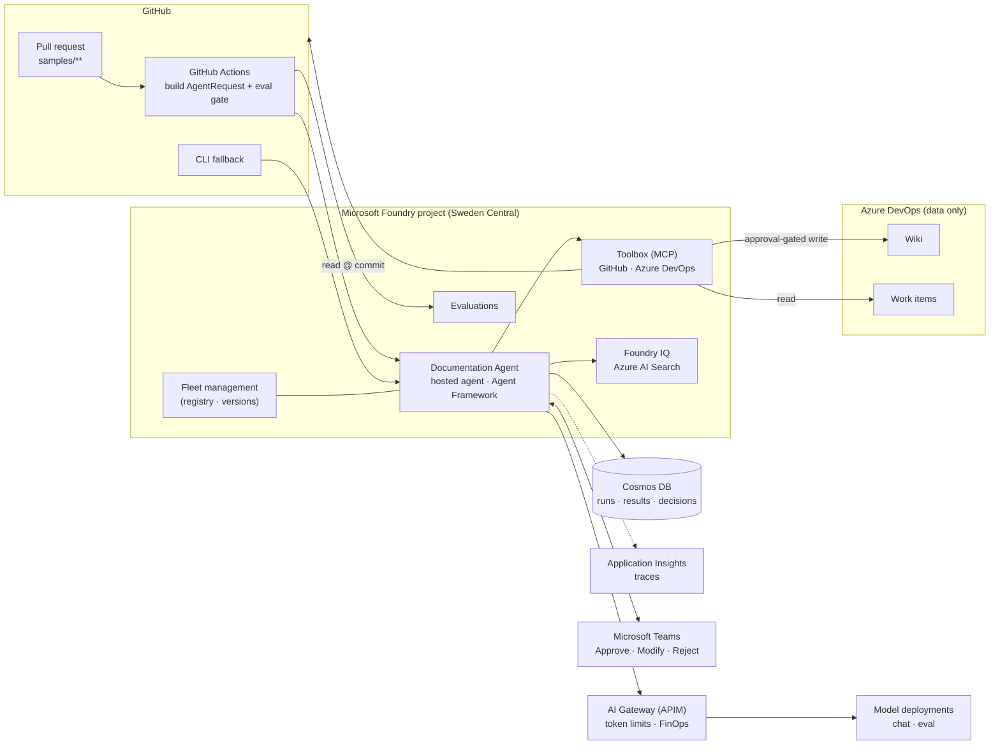

# foundry-agentic-pattern

Reference pattern for building **governed, versioned, evaluated agents on Microsoft Foundry**, with a minimal **Documentation Agent** as the first implementation.

> **Status:** early design phase (M0). This repo currently contains architecture docs, decision records (ADRs) and the folder skeleton. Infrastructure and agent code arrive in M1+ — see [Roadmap](#status--roadmap).

---

## What and why

Most organisations don't need *one* agent. They need a **repeatable way to build many**: the same contract, identity model, approval flow, audit trail, evaluation gate and release process every time. This repo has two parts:

1. **Agentic Pattern v1.** The foundation any future agent plugs into: agent contract, registry, tool/API pattern, knowledge/RAG, identity/RBAC, human approval, tracing/audit, evaluation, CI/CD, versioning and rollback.
2. **Documentation Agent v1.** One deliberately small reference agent that exercises the whole pattern end to end. When an implementation change is made, the agent compares the code, IaC and configuration against the existing documentation and the organisation's documentation standard. It proposes evidence-backed updates, and a human approves them before anything is written.

The repo **is the product**. It is delivered through a half-day, demo-driven workshop ([agenda](docs/workshop/agenda.md)). Attendees fork it, plug in their own sources and their own documentation standard, and run `azd up`.

### The Documentation Agent story

1. A pull request changes the sample integration (`samples/**`).
2. GitHub Actions builds an `AgentRequest` and calls the hosted agent. A CLI is available as a manual fallback.
3. The agent reads **controlled sources**: code/IaC/config at the exact commit, the current wiki, work items/requirements, ADRs and the documentation standard.
4. It runs a **gap analysis** and returns an `AgentResult`: documentation status, findings (category, severity, description), proposed changes, missing information, source references/evidence, confidence, and whether human review is required.
5. A human reviews the result in **Microsoft Teams**:
   - **Approve**: the wiki is updated.
   - **Modify**: the feedback goes back to the agent.
   - **Reject**: nothing changes.
6. Every run is logged with the agent, model, prompt, policy and contract version.

> **Hard rule:** if a fact cannot be supported by a source, the agent reports *"Information missing"*. It never fabricates.

## Architecture overview



For more detail, see [docs/architecture.md](docs/architecture.md). The design rationale is in [docs/adr/](docs/adr/README.md) and the known risks are in [docs/risks.md](docs/risks.md).

## Feature map

| Capability | How it is implemented | ADR |
|---|---|---|
| **Agent contract** | Pydantic `AgentRequest` / `AgentResult` are the single source of truth, and JSON Schema is generated from them. The agent is trigger-agnostic. | [0010](docs/adr/0010-python-and-pydantic-contracts.md), [0006](docs/adr/0006-sources-and-trigger.md) |
| **Runtime** | Foundry hosted agent (container) on Microsoft Agent Framework | [0009](docs/adr/0009-hosted-agent-runtime.md) |
| **Registry** | Foundry fleet management, with no custom registry | [0015](docs/adr/0015-registry-foundry-fleet-management.md) |
| **Knowledge** | Foundry IQ (Azure AI Search) for stable knowledge, plus Toolbox live calls for versioned/volatile data | [0011](docs/adr/0011-knowledge-foundry-iq-and-toolbox.md) |
| **Toolbox / APIs** | MCP tools for GitHub and Azure DevOps. Wiki write is approval-gated. | [0011](docs/adr/0011-knowledge-foundry-iq-and-toolbox.md), [0008](docs/adr/0008-human-in-the-loop-approval.md) |
| **Human-in-the-loop** | Agent published to Teams, with Approve / Modify / Reject | [0008](docs/adr/0008-human-in-the-loop-approval.md) |
| **Identity / RBAC** | Entra Agent ID with least privilege per source. The approver is recorded. | [0012](docs/adr/0012-agent-identity-and-rbac.md) |
| **State & audit** | Cosmos DB stores runs, results, review decisions and pending approvals | [0016](docs/adr/0016-state-and-audit-cosmos-db.md) |
| **Observability** | OpenTelemetry traces to Application Insights, with every output tagged with agent/model/prompt/policy/contract version | [0016](docs/adr/0016-state-and-audit-cosmos-db.md) |
| **Evaluation** | Ground-truth eval gate in CI, plus Foundry evaluators that are reported but non-blocking | [0013](docs/adr/0013-evaluation-gate-in-ci.md) |
| **CI/CD, versioning, rollback** | GitHub Actions; agent versions; endpoint `version_selector` for canary/rollback | [0003](docs/adr/0003-github-for-code-and-cicd.md), [0013](docs/adr/0013-evaluation-gate-in-ci.md) |
| **AI Gateway / FinOps** | APIM token limits per project + deployment, and cost attribution per agent/version via tagged calls | [0014](docs/adr/0014-infrastructure-scope.md) |

## Repository layout

```text
.
├── infra/                          # azd + Bicep: Foundry, models, AI Search, APIM, Cosmos DB, App Insights, RBAC
├── src/
│   ├── contracts/                  # Pydantic AgentRequest / AgentResult (+ generated JSON Schema)
│   ├── agents/
│   │   └── documentation-agent/    # Foundry hosted agent (Microsoft Agent Framework)
│   └── tools/                      # Toolbox / MCP tool definitions and helpers
├── samples/
│   └── sample-integration/         # Fictional integration: code, IaC, config (the agent's "subject")
├── data/                           # Mock data generator: wiki, work items, ADRs, doc standard, planted gaps
├── evals/                          # Ground-truth eval sets, metrics and CI gate
├── .github/
│   └── workflows/                  # CI/CD (added in M1+)
└── docs/
    ├── architecture.md
    ├── risks.md
    ├── next-steps.md
    ├── adr/                        # Architecture Decision Records
    └── workshop/                   # Workshop agenda and material
```

## Status & roadmap

| Milestone | Goal | Status |
|---|---|---|
| **M0 · Spikes** | Close the open risks R1–R4 ([risks](docs/risks.md)) | 🟡 In progress |
| **M1 · Walking skeleton** | `azd up` deploys a hosted agent that accepts an `AgentRequest` and returns a schema-valid stub `AgentResult`. The run produces a trace in App Insights and a row in Cosmos DB, and can be triggered from the CLI. | ⚪ Planned |
| **M2 · Pattern tracks** | Agent architecture, knowledge & identity, and AgentOps & platform built in parallel | ⚪ Planned |
| **M3 · End-to-end demo** | PR → result → Teams approval → wiki updated. The eval gate blocks a bad version and a rollback is shown. | ⚪ Planned |
| **M4 · Workshop packaging** | Docs per area, final diagrams, slides, dry run | ⚪ Planned |

Progress is tracked in [GitHub milestones](https://github.com/wdhm/foundry-agentic-pattern/milestones) and [issues](https://github.com/wdhm/foundry-agentic-pattern/issues).

## Fork & adapt

The pattern is designed to be forked privately and adapted. Typical changes:

1. **Documentation standard.** Replace the standard file in `data/` with your own. It also controls the output language.
2. **Sources.** Point the Toolbox connections at your own GitHub repos and Azure DevOps project, or at other sources through MCP.
3. **Subject.** Replace `samples/sample-integration/` with a real integration, or point the trigger at your own repos.
4. **Ground truth.** Add your own planted gaps and expected findings in `evals/` so that the gate reflects your quality bar.
5. **Identity.** Grant the agent identity least-privilege access to your sources ([ADR 0012](docs/adr/0012-agent-identity-and-rbac.md)).
6. **Deploy.** Run `azd up` (available from M1).

To add a *new* agent, reuse the contract, identity, approval, audit, eval and CI/CD building blocks, and implement only the agent-specific prompt, tools and ground truth.

## Contributing

See [CONTRIBUTING.md](CONTRIBUTING.md). Significant design changes require an ADR.

## Disclaimer

This is a **sample / reference implementation** provided for learning and demonstration purposes. It is **not a supported product** and is **not production-ready as-is**. Review security, compliance, cost and operational requirements before using any part of it in your own environment. All sample data and the sample integration are fictional.

## License

[MIT](LICENSE)
