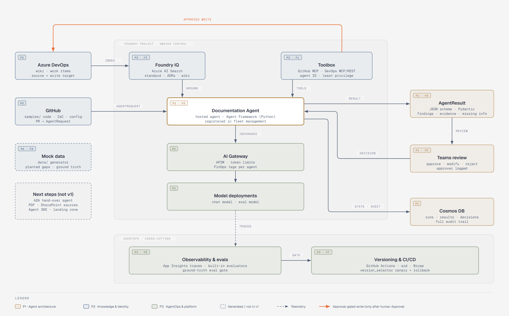
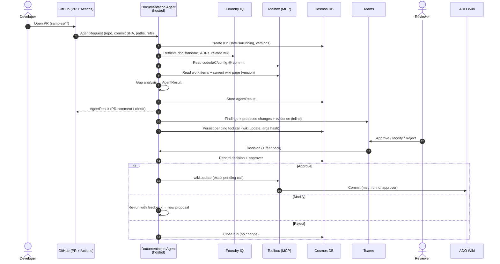
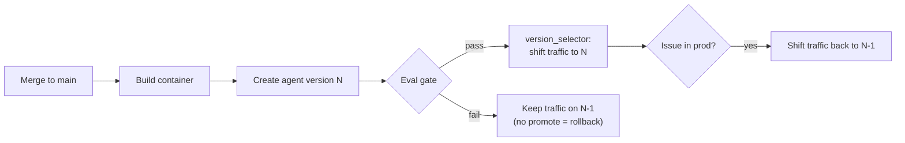

# Architecture

This document describes **Agentic Pattern v1** and the **Documentation Agent v1** reference implementation. Each design choice is recorded as an ADR in [adr/](adr/README.md), and open risks are listed in [risks.md](risks.md).

**Diagrams:** the reference architecture ([HTML](diagrams/reference-architecture.html) · [PNG](diagrams/reference-architecture.png)) and the feature swimlanes ([HTML](diagrams/feature-swimlanes.html) · [PNG](diagrams/feature-swimlanes.png)). The feature tags **F1–F8** and lane owners **P1/P2/P3** used below match these diagrams and the [workshop feature map](workshop/feature-map.md).

> **MVP scope:** the workshop builds a simple MVP that shows the platform ([ADR 0022](adr/0022-mvp-scope-platform-first.md)). Sections 6 (identity & RBAC matrix), 7 (audit record) and 9 (cost & limits) describe the **target** architecture. In the MVP, they are partly covered by platform features and partly shown on slides ([next steps §9](next-steps.md#9-production-hardening-out-of-mvp-scope)).

## 1. Principles

- **The contract is the interface.** Agents accept an `AgentRequest` and return an `AgentResult`. They are trigger-agnostic.
- **Evidence or "Information missing."** Every claim must point to a source at an exact version. The agent never fabricates.
- **Humans approve writes.** Any write to a system of record goes through an approval-gated tool.
- **Everything is versioned and auditable**: agent, model, prompt, policy and contract versions are recorded with every output.
- **Nothing ships without passing evals.** A failed gate means no promotion, which is an automatic rollback.
- **Use the platform.** Foundry fleet management, Toolbox, Foundry IQ, the AI Gateway and evaluators are used instead of custom equivalents.

## 2. Components

Lanes: **P1** Agent architecture · **P2** Knowledge & identity · **P3** AgentOps & platform.

| Lane | F | Component | Technology | Responsibility | ADR |
|---|---|---|---|---|---|
| P1 | F2 | Agent runtime | Foundry hosted agent, Microsoft Agent Framework (Python) | Orchestration, gap analysis, approval interrupt | [0009](adr/0009-hosted-agent-runtime.md) |
| P1 | F4 | Contract | Pydantic → JSON Schema | Single source of truth for request/result | [0010](adr/0010-python-and-pydantic-contracts.md) |
| P1 | F5 | Human-in-the-loop | Agent published to Microsoft Teams | Approve / Modify / Reject | [0008](adr/0008-human-in-the-loop-approval.md) |
| P1 | – | State & audit | Cosmos DB | Runs, results, review decisions, pending approvals | [0016](adr/0016-state-and-audit-cosmos-db.md) |
| P1 | – | Registry | Foundry fleet management | Agent inventory, versions, endpoints | [0015](adr/0015-registry-foundry-fleet-management.md) |
| P2 | F3 | Stable knowledge | Foundry IQ (Azure AI Search) | Documentation standard, ADRs, wiki (semantic search) | [0011](adr/0011-knowledge-foundry-iq-and-toolbox.md) |
| P2 | F1 | Live tools | Foundry Toolbox (MCP / REST): GitHub, Azure DevOps | Code/IaC/config at commit (GitHub or Azure Repos), work items, current wiki, wiki write | [0011](adr/0011-knowledge-foundry-iq-and-toolbox.md) |
| P2 | – | Identity & resource org | Entra Agent ID (fallback: project or user-assigned MI) | Least-privilege access per source | [0012](adr/0012-agent-identity-and-rbac.md) |
| P2 | F8 | Mock data | `data/` generator + `samples/` | Sample integration, wiki, work items, planted gaps, ground truth | [0005](adr/0005-generic-repo-with-fictional-data.md) |
| P3 | – | Trigger | GitHub Actions (PR on `samples/**`), CLI fallback | Builds and submits the `AgentRequest` | [0006](adr/0006-sources-and-trigger.md) |
| P3 | – | Model access | AI Gateway (APIM) → model deployments (chat, eval) | Token limits, FinOps tagging, version pinning | [0014](adr/0014-infrastructure-scope.md) |
| P3 | F6 | Observability | OpenTelemetry → Application Insights | Traces, metrics, cost queries | [0016](adr/0016-state-and-audit-cosmos-db.md) |
| P3 | F6 | Evaluation | Custom ground-truth metrics + Foundry evaluators | CI gate, quality trends | [0013](adr/0013-evaluation-gate-in-ci.md) |
| P3 | F7 | Versioning & CI/CD | GitHub Actions, agent versions, `version_selector` | Build, gate, promote, roll back | [0003](adr/0003-github-for-code-and-cicd.md), [0013](adr/0013-evaluation-gate-in-ci.md) |

## 3. Request lifecycle

## 4. Contract overview

See [src/contracts/](../src/contracts/README.md) for the field list. Key properties:

- `AgentResult.evidence[]` always carries an **exact version**: commit SHA, wiki page version/ETag or work item revision.
- `AgentResult.missing_information[]` is the only acceptable way to express unknowns.
- `AgentResult.provenance` records the agent, model, prompt, policy and contract versions.
- JSON Schema is generated from the Pydantic models and checked for drift in CI.

## 5. Knowledge strategy

| Data | Volatility | Access path | Why |
|---|---|---|---|
| Documentation standard | Stable | Foundry IQ | Semantic retrieval of rules and sections |
| ADRs (of the subject) | Stable | Foundry IQ | Semantic retrieval of rationale |
| Wiki (for discovery) | Medium | Foundry IQ | Find related pages |
| **Current** wiki page | Volatile | Toolbox (ADO) | Exact version required for evidence and update |
| Work items / requirements | Volatile | Toolbox (ADO) | Exact revision |
| Code / IaC / config | Versioned | Toolbox (GitHub MCP; Azure Repos via ADO MCP/REST) | Exact commit SHA |

## 6. Identity & RBAC matrix (target)

| Principal | Resource | Permission | Notes |
|---|---|---|---|
| Agent identity | GitHub repo | Read contents/PRs | Via GitHub MCP connection |
| Agent identity | ADO work items | Read | [R3](risks.md#r3) |
| Agent identity | ADO wiki | Read; **write only via approval-gated tool** | [R3](risks.md#r3), [ADR 0008](adr/0008-human-in-the-loop-approval.md) |
| Agent identity | Azure AI Search | Search Index Data Reader | |
| Agent identity | Cosmos DB | Data contributor (agent DB only) | |
| Agent identity | AI Gateway / models | Invoke | Via the gateway |
| CI (OIDC) | Foundry project | Create agent versions, run evals, update `version_selector` | |
| CI (OIDC) | Role assignments | Assign roles to the new agent identity post-deploy | [R3](risks.md#r3) |
| Reviewer (human) | Teams agent | Chat + approve | Recorded as the approver |

Agent identity role assignments are made **post-deploy** because publishing creates a new identity ([R3](risks.md#r3)). On-behalf-of (OBO) is the documented alternative ([ADR 0012](adr/0012-agent-identity-and-rbac.md)).

## 7. Audit record

Every run stores the following in Cosmos DB, keyed by `run_id`:

| Field | Example |
|---|---|
| `run_id`, `request_id`, `correlation_id` | UUIDs |
| `trigger`, `requested_by` | `github_pr`, PR author |
| `agent_name`, `agent_version` | `documentation-agent`, `3` |
| `model`, `model_version` | Chat deployment name/version |
| `prompt_version`, `policy_version`, `contract_version` | Semantic versions |
| `request`, `result` | Full payloads |
| `review.decision`, `review.approver`, `review.timestamp`, `review.feedback` | `approved`, UPN, ISO time |
| `tool_calls[]` (incl. pending/approved/rejected) | Tool name, args hash, status |
| `wiki_commit` | Commit/version written, if any |
| `trace_id` | App Insights operation ID |
| `token_usage` | Prompt/completion tokens for FinOps |

## 8. Release, versioning & rollback

- Agent versions are managed in Foundry fleet management ([ADR 0015](adr/0015-registry-foundry-fleet-management.md)).
- Traffic shifting uses the endpoint `version_selector` / `traffic_percentage`, with no republish needed ([R2](risks.md#r2)).

## 9. Cost & limits

- Token limits are enforced at the AI Gateway **per project + deployment** ([R4](risks.md#r4)).
- Cost per agent/version comes from tagged calls aggregated in APIM logs and App Insights (FinOps pattern).

## 10. Beyond v1

See [next-steps.md](next-steps.md). These topics are covered on slides only, at the end of each lane: A2A hand-over (P1); Agent 365, Work IQ and PDF/SharePoint document sources (P2); landing zones & subscription vending and model deployment strategy (P3).
