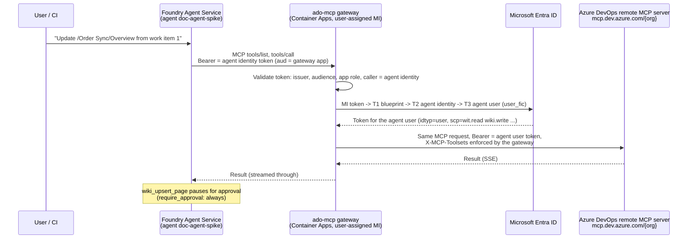

# Workshop guide: a Foundry agent that writes to Azure DevOps as itself

This guide explains how the Documentation Agent reads work items and updates the Azure DevOps wiki under **its own identity**. No person's account and no stored secrets are involved. It records what we tried, what failed and why, and the exact setup steps. Each step links to Microsoft Learn.

> Decision: [ADR 0021](../adr/0021-agent-user-and-ado-mcp-gateway.md). Risk: [R3](../risks.md#r3). Environment values: [setup runbook](../setup.md#agent-identity-and-azure-devops). Code: [`src/tools/ado_mcp`](../../src/tools/ado_mcp/README.md).

## The result



What the wiki history shows: the commit author is **`doc-agent-spike (agent user)`**, not a person.

## Concepts in one minute

| Concept | What it is | Learn |
|---|---|---|
| **Agent identity** | A special service principal that Foundry creates for each agent. Foundry uses it to authenticate the agent to tools. | [Agent identity concepts in Foundry](https://learn.microsoft.com/azure/foundry/agents/concepts/agent-identity) |
| **Agent identity blueprint** | The application that agent identities are created from. It holds the credentials (federated credentials) that can request tokens for the agent identities. | [Create an agent identity blueprint](https://learn.microsoft.com/entra/agent-id/create-blueprint) |
| **Agent user** (agent's user account) | A user object linked 1:1 to an agent identity, for systems that only accept users. Its tokens carry `idtyp=user`. | [Create agentUser (Graph)](https://learn.microsoft.com/graph/api/agentuser-post?view=graph-rest-1.0), [Agent user OAuth flow](https://learn.microsoft.com/entra/agent-id/agent-user-oauth-flow) |
| **Agent user OAuth flow** | A token exchange: blueprint token (T1), then agent identity token (T2), then a token for the agent user (T3, `grant_type=user_fic`). | [Agent user OAuth flow](https://learn.microsoft.com/entra/agent-id/agent-user-oauth-flow) |
| **Remote Azure DevOps MCP server** | An MCP server that Microsoft hosts at `https://mcp.dev.azure.com/{org}`. It is Entra-authenticated, and you can restrict its tools with `X-MCP-*` headers. | [Set up the remote Azure DevOps MCP Server](https://learn.microsoft.com/azure/devops/mcp-server/remote-mcp-server) |
| **Foundry MCP tool + project connection** | The agent calls an MCP server through a project connection. With `AgenticIdentityToken` auth, Foundry sends an agent identity token for the connection's audience. | [MCP tool authentication](https://learn.microsoft.com/azure/foundry/agents/how-to/mcp-authentication), [Connect agents to MCP servers](https://learn.microsoft.com/azure/foundry/agents/how-to/tools/model-context-protocol) |

## What we tried and learned

| # | Attempt | Result | Learning |
|---|---|---|---|
| 1 | Agent identity → Azure DevOps REST (app-only token) | ❌ Azure DevOps could not resolve the identity | Azure DevOps supports service principals and managed identities, but **not agent identities**. Learn does not document agent identity support for Azure DevOps. |
| 2 | Foundry MCP tool → `mcp.dev.azure.com` directly, connection `AgenticIdentityToken` | ❌ First a 401 (wrong audience); with audience `https://mcp.dev.azure.com`: *"Identity … is currently Deleted"* | Get the audience from `/.well-known/oauth-protected-resource/{org}`. Even with the right audience, Azure DevOps rejects the agent identity's app-only token. |
| 3 | Agent **user** token (user_fic flow) → Azure DevOps REST | ✅ Read work items, wiki commit by "doc-agent-spike (agent user)" | Azure DevOps accepts the agent user like any member user. It needs a license and project permissions. |
| 4 | Agent **user** token → Microsoft's remote Azure DevOps MCP server | ✅ `initialize`, `tools/list`, `wit_work_item`, `wiki_upsert_page` | You get Microsoft's maintained tools; you only add the identity exchange. |
| 5 | Foundry → **our gateway** → Microsoft's MCP server, as the agent user | ✅ End to end, with approval on the write tool | This is the chosen design ([ADR 0021](../adr/0021-agent-user-and-ado-mcp-gateway.md)). |

### Options we compared

| Option | Identity in Azure DevOps | Unattended | Verdict |
|---|---|---|---|
| **A.** Our own MCP server calling the Azure DevOps REST API | Agent user | ✅ | Works, but we would maintain tool code that Microsoft already ships. |
| **B.** Thin gateway in front of Microsoft's remote MCP server (**chosen**) | Agent user | ✅ | Small code (identity exchange + header policy) and Microsoft's tools. |
| **C.** Microsoft's server via Foundry OAuth passthrough (catalog) | **A signed-in person** | ❌ | Ruled out: actions are attributed to a person and need an interactive sign-in. |

**Why a gateway is needed at all:** Foundry can send only the agent identity's token (an app token), and Azure DevOps accepts only the agent user. The user_fic exchange must run somewhere that holds a blueprint credential. Foundry does not do that exchange, so our gateway does.

## Setup, step by step

Placeholders: `<tenant>`, `<blueprint-app-id>`, `<agent-identity-id>`, `<agent-user-upn>`, `<mi-client-id>`, `<gateway-app-id>`. The real values for the shared environment are in the [setup runbook](../setup.md#agent-identity-and-azure-devops).

### 1. Create the Foundry agent (this creates the agent identity)

Create a prompt agent in the Foundry project (portal or `POST {project}/agents/{name}/versions`). Foundry creates the **agent identity blueprint** and the **agent identity**. In Entra, the agent identity appears as `<account>-<project>-<agent>-AgentIdentity`.

- Learn: [Agent identity concepts](https://learn.microsoft.com/azure/foundry/agents/concepts/agent-identity)
- Gotcha: **publishing** an agent creates a **new** agent identity ([R3](../risks.md#r3)), so the steps below must be repeated for it, which means automating them in CI later.

### 2. Create the agent user

Create the agent user with Microsoft Graph, linked to the agent identity:

```http
POST https://graph.microsoft.com/beta/users
{
  "@odata.type": "microsoft.graph.agentUser",
  "displayName": "doc-agent-spike (agent user)",
  "userPrincipalName": "doc-agent-spike@<tenant-domain>",
  "mailNickname": "doc-agent-spike",
  "accountEnabled": true,
  "identityParentId": "<agent-identity-id>"
}
```

- Learn: [Create agentUser](https://learn.microsoft.com/graph/api/agentuser-post?view=graph-rest-1.0), [New-EntraAgentUserForAgentId](https://learn.microsoft.com/powershell/module/microsoft.entra.users/new-entraagentuserforagentid?view=entra-powershell)
- The agent user has no password. It can only get tokens through the agent identity.

### 3. Give the agent user access in Azure DevOps

1. Add the agent user to the organization (Organization settings → Users), with access level **Basic**. Stakeholder can't edit the wiki.
2. Add it to the project's **Contributors** group, or to a narrower custom group with *work item read* and *wiki contribute*.

- Learn: [Add organization users](https://learn.microsoft.com/azure/devops/organizations/accounts/add-organization-users), [Access levels](https://learn.microsoft.com/azure/devops/organizations/security/access-levels), [Wiki permissions](https://learn.microsoft.com/azure/devops/project/wiki/manage-readme-wiki-permissions)

### 4. Register the Azure DevOps MCP resource in the tenant and grant consent

The remote MCP server's Entra application is **"Azure DevOps MCP"** (appId `2a72489c-aab2-4b65-b93a-a91edccf33b8`). It exposes fine-grained delegated scopes such as `wit.read`, `wiki.read` and `wiki.write`, plus `Ado.Mcp.Tools`.

1. If the tenant has no service principal for it yet, create one:
   ```http
   POST https://graph.microsoft.com/v1.0/servicePrincipals
   { "appId": "2a72489c-aab2-4b65-b93a-a91edccf33b8" }
   ```
2. Grant **delegated consent for the agent user only** (consentType `Principal`), with the agent identity as the client:
   ```http
   POST https://graph.microsoft.com/v1.0/oauth2PermissionGrants
   {
     "clientId": "<agent-identity-id>",
     "consentType": "Principal",
     "principalId": "<agent-user-object-id>",
     "resourceId": "<azure-devops-mcp-sp-object-id>",
     "scope": "Ado.Mcp.Tools wit.read wiki.read wiki.write"
   }
   ```

- Learn: [Create oauth2PermissionGrant](https://learn.microsoft.com/graph/api/oauth2permissiongrant-post?view=graph-rest-1.0), [Agent user OAuth flow](https://learn.microsoft.com/entra/agent-id/agent-user-oauth-flow)
- Gotcha: without this grant, T3 fails with **AADSTS65001** (no consent). Grant only the scopes the agent needs.
- Tip: find the resource and scope with `GET https://mcp.dev.azure.com/.well-known/oauth-protected-resource/{org}`.

### 5. Create the gateway's identity: a user-assigned managed identity as a blueprint credential

1. Create a user-assigned managed identity (`id-doc-agent-mcp`).
2. Add a **federated identity credential** on the **blueprint** application that trusts this managed identity (issuer `https://login.microsoftonline.com/<tenant>/v2.0`, subject = MI principal id, audience `api://AzureADTokenExchange`).

- Learn: [Configure credentials for the blueprint](https://learn.microsoft.com/entra/agent-id/create-blueprint#configure-credentials-for-the-agent-identity-blueprint), [Workload identity federation with managed identities](https://learn.microsoft.com/entra/workload-id/workload-identity-federation-config-app-trust-managed-identity)
- Result: the gateway can run the agent user flow **with no secrets**.
- Open question: Foundry manages this blueprint. Check after publish and upgrades that our extra credential survives ([R3](../risks.md#r3)).

### 6. Protect the gateway with its own Entra app

1. Register an app `doc-agent-mcp-api`. Set its identifier URI to `api://<gateway-app-id>` and add an **app role** `Mcp.Tools.ReadWrite.All` (allowed member type: Applications).
2. Assign the app role to the **agent identity**.
3. The gateway accepts only tokens where:
   - the audience is this app;
   - the role is present;
   - `azp`/`appid` is the agent identity.

- Learn: [Deploy a self-hosted remote MCP server and connect it from Foundry](https://learn.microsoft.com/azure/developer/azure-mcp-server/how-to/deploy-remote-mcp-server-microsoft-foundry) (the same Entra app + app role pattern), [Add app roles](https://learn.microsoft.com/entra/identity-platform/howto-add-app-roles-in-apps)

### 7. Deploy the gateway

The code is in [`src/tools/ado_mcp`](../../src/tools/ado_mcp/README.md). It is a small ASGI app that:

1. validates the inbound agent identity token;
2. runs MI → T1 → T2 → T3 to get the agent user token, and caches it;
3. forwards `/mcp` to `https://mcp.dev.azure.com/{org}`. Only the MCP transport headers are forwarded, and the gateway sets `X-MCP-Toolsets` itself;
4. logs which MCP method or tool the agent called (no arguments or content).

```powershell
az acr build -r <acr> -t ado-mcp:<version> src/tools/ado_mcp
az containerapp env create -g <rg> -n cae-doc-agent-mcp -l northeurope --logs-destination none
az containerapp create -g <rg> -n ca-doc-agent-mcp --environment cae-doc-agent-mcp `
  --image <acr>.azurecr.io/ado-mcp:<version> --registry-server <acr>.azurecr.io `
  --registry-identity <mi-resource-id> --user-assigned <mi-resource-id> `
  --ingress external --target-port 8000 --min-replicas 1 --max-replicas 1 `
  --env-vars AZURE_TENANT_ID=<tenant> MCP_APP_CLIENT_ID=<gateway-app-id> `
    AGENT_BLUEPRINT_CLIENT_ID=<blueprint-app-id> AGENT_IDENTITY_CLIENT_ID=<agent-identity-id> `
    AGENT_USER_UPN=<agent-user-upn> MANAGED_IDENTITY_CLIENT_ID=<mi-client-id> `
    ADO_ORG=<org> ADO_MCP_TOOLSETS=wit,wiki
```

- Learn: [Container Apps managed identity image pull](https://learn.microsoft.com/azure/container-apps/managed-identity-image-pull), [Managed identities in Container Apps](https://learn.microsoft.com/azure/container-apps/managed-identity)
- Check: `GET /healthz` returns 200, and `POST /mcp` without a token returns 401.

### 8. Connect the gateway to the agent in Foundry

1. Create a **project connection**: category `RemoteTool`, authType `AgenticIdentityToken`, target `https://<gateway-fqdn>/mcp`, audience `api://<gateway-app-id>`.
2. Add an **MCP tool** to the agent version. Use `project_connection_id` = the connection, list `allowed_tools`, and set `require_approval` to `always` for write tools:

```json
{
  "type": "mcp",
  "server_label": "ado",
  "server_url": "https://<gateway-fqdn>/mcp",
  "project_connection_id": "ado-mcp-proxy",
  "allowed_tools": ["wit_work_item", "wit_query", "wiki", "search_wiki", "search_workitem", "wiki_upsert_page"],
  "require_approval": {
    "never":  { "tool_names": ["wit_work_item", "wit_query", "wiki", "search_wiki", "search_workitem"] },
    "always": { "tool_names": ["wiki_upsert_page"] }
  }
}
```

- Learn: [MCP tool authentication (agent identity)](https://learn.microsoft.com/azure/foundry/agents/how-to/mcp-authentication#microsoft-entra-authentication), [Connect agents to MCP servers](https://learn.microsoft.com/azure/foundry/agents/how-to/tools/model-context-protocol)

### 9. Verify end to end

1. **Read:** call `POST {project}/openai/v1/responses` with `agent_reference` and the prompt "Read work item 1 …". The output contains `mcp_list_tools` → `mcp_call wit_work_item` → `message`.
2. **Write with approval:** ask the agent to update a wiki page. The output contains `mcp_approval_request` for `wiki_upsert_page`. Send a second call with `previous_response_id` and an input item `{"type": "mcp_approval_response", "approve": true, "approval_request_id": "<id>"}`.
3. **Audit:**
   - The wiki commit author is `doc-agent-spike (agent user)`.
   - The gateway log shows `authorized caller oid=<agent-identity-id>` and `rpc=tools/call tool=wiki_upsert_page`.

## Gotchas we hit

| Symptom | Cause | Fix |
|---|---|---|
| `401` from `mcp.dev.azure.com` | The Azure DevOps REST audience was used | Use the audience/scope from `/.well-known/oauth-protected-resource/{org}` (`https://mcp.dev.azure.com`, appId `2a72489c-…`) |
| *"Identity … is currently Deleted"* | Azure DevOps rejects agent identity (app-only) tokens | Use the agent user via the gateway |
| `AADSTS65001` on T3 | No delegated consent for the agent user | Create the oauth2PermissionGrant (step 4) |
| `HTML 400 Bad Request` from upstream | The gateway forwarded ingress headers (`x-forwarded-*`, `x-envoy-*` …) | Forward only `content-type`, `accept`, `mcp-session-id`, `mcp-protocol-version` and `last-event-id` |
| Container Apps environment create fails in Sweden Central | `AKSCapacityHeavyUsage` (regional capacity) | Use another region (we used North Europe). Foundry calls the gateway over HTTPS. |
| The Azure CLI can't get a token for the gateway app | The Azure CLI is not a consented client of the custom API | Expected. Only the agent identity has the app role. |

## Security notes (hardening comes later, per ADR 0020)

- The agent user has Basic + Contributors. Narrow this to a custom group with only wiki contribute and work item read.
- `tools/list` from Microsoft's server shows write tools even though only `wit.read` is granted. The gateway's `X-MCP-Toolsets` and the agent's `allowed_tools` limit what the agent can call. The server's per-scope enforcement is not verified yet.
- The gateway's ingress is public, but token validation is enforced. Consider private networking.
- Container logs go to the console only (`--logs-destination none`). Wire them to Log Analytics together with tracing.
