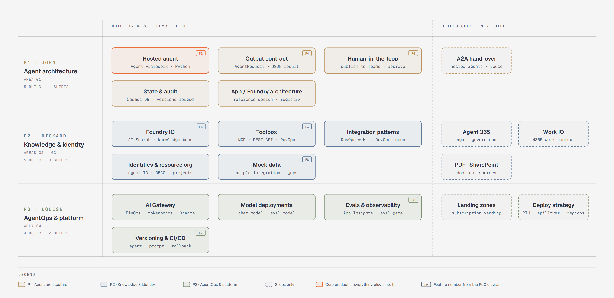

# Feature map: three swimlanes

Every workshop feature has **one owner**: **P1** John ([@johnsward](https://github.com/johnsward)), **P2** Rickard ([@wdhm](https://github.com/wdhm)) or **P3** Louise ([@llandinl](https://github.com/llandinl)). It is either **built in the repo and demoed live**, or covered **on slides only** as a next step. The feature numbers **F1–F8** are the same as in the diagrams.

| Diagram | HTML | PNG |
|---|---|---|
| Feature swimlanes (P1 / P2 / P3) | [feature-swimlanes.html](../diagrams/feature-swimlanes.html) | [feature-swimlanes.png](../diagrams/feature-swimlanes.png) |
| Reference architecture v1 | [reference-architecture.html](../diagrams/reference-architecture.html) | [reference-architecture.png](../diagrams/reference-architecture.png) |

> The HTML files are self-contained. To view the rendered version, open them locally or download them.

## F-tag index

| F-tag | Feature | Owner |
|---|---|---|
| F1 | Toolbox (MCP · REST · Azure DevOps) | P2 |
| F2 | Hosted agent: the core product, which everything plugs into | P1 |
| F3 | Foundry IQ | P2 |
| F4 | Output contract (`AgentRequest` → JSON `AgentResult`) | P1 |
| F5 | Human-in-the-loop (publish to Teams, approve) | P1 |
| F6 | Evals & observability | P3 |
| F7 | Versioning & CI/CD | P3 |
| F8 | Mock data | P2 |

## P1: Agent architecture (area 01) · John

| Feature | F-tag | Built/Slides | Issue(s) |
|---|---|---|---|
| Hosted agent (Agent Framework · Python) | F2 | Built | [#7](https://github.com/wdhm/foundry-agentic-pattern/issues/7), [#13](https://github.com/wdhm/foundry-agentic-pattern/issues/13) |
| Output contract (`AgentRequest` → JSON result) | F4 | Built | [#6](https://github.com/wdhm/foundry-agentic-pattern/issues/6), [#12](https://github.com/wdhm/foundry-agentic-pattern/issues/12) |
| Human-in-the-loop (publish to Teams · approve) | F5 | Built | [#1](https://github.com/wdhm/foundry-agentic-pattern/issues/1), [#15](https://github.com/wdhm/foundry-agentic-pattern/issues/15), [#16](https://github.com/wdhm/foundry-agentic-pattern/issues/16), [#31](https://github.com/wdhm/foundry-agentic-pattern/issues/31) |
| State & audit (Cosmos DB · versions logged) | – | Built | [#8](https://github.com/wdhm/foundry-agentic-pattern/issues/8), [#14](https://github.com/wdhm/foundry-agentic-pattern/issues/14) |
| App / Foundry architecture + fleet registry | – | Built | [#42](https://github.com/wdhm/foundry-agentic-pattern/issues/42), [#38](https://github.com/wdhm/foundry-agentic-pattern/issues/38) |
| A2A hand-over | – | Slides | [#43](https://github.com/wdhm/foundry-agentic-pattern/issues/43) |

## P2: Knowledge & identity (areas 02 + 03) · Rickard

| Feature | F-tag | Built/Slides | Issue(s) |
|---|---|---|---|
| Foundry IQ (AI Search · knowledge base) | F3 | Built | [#19](https://github.com/wdhm/foundry-agentic-pattern/issues/19) |
| Toolbox (MCP · REST · Azure DevOps) | F1 | Built | [#20](https://github.com/wdhm/foundry-agentic-pattern/issues/20), [#21](https://github.com/wdhm/foundry-agentic-pattern/issues/21) |
| Integration patterns (Azure DevOps wiki · Azure Repos) | – | Built | [#44](https://github.com/wdhm/foundry-agentic-pattern/issues/44) |
| Identities & resource organisation (agent ID · RBAC · projects) | – | Built | [#2](https://github.com/wdhm/foundry-agentic-pattern/issues/2), [#22](https://github.com/wdhm/foundry-agentic-pattern/issues/22), [#45](https://github.com/wdhm/foundry-agentic-pattern/issues/45) |
| Mock data (sample integration · planted gaps) | F8 | Built | [#17](https://github.com/wdhm/foundry-agentic-pattern/issues/17), [#18](https://github.com/wdhm/foundry-agentic-pattern/issues/18), [#32](https://github.com/wdhm/foundry-agentic-pattern/issues/32) |
| Agent 365 (agent governance) | – | Slides | [#46](https://github.com/wdhm/foundry-agentic-pattern/issues/46) |
| Work IQ (Microsoft 365 work context) | – | Slides | [#47](https://github.com/wdhm/foundry-agentic-pattern/issues/47) |
| PDF · SharePoint (document sources) | – | Slides | [#48](https://github.com/wdhm/foundry-agentic-pattern/issues/48) |

## P3: AgentOps & platform (area 04) · Louise

| Feature | F-tag | Built/Slides | Issue(s) |
|---|---|---|---|
| AI Gateway (FinOps · tokenomics · limits) | – | Built | [#3](https://github.com/wdhm/foundry-agentic-pattern/issues/3), [#23](https://github.com/wdhm/foundry-agentic-pattern/issues/23) |
| Model deployments (chat model · eval model) | – | Built | [#5](https://github.com/wdhm/foundry-agentic-pattern/issues/5), [#49](https://github.com/wdhm/foundry-agentic-pattern/issues/49) |
| Evals & observability (App Insights · eval gate) | F6 | Built | [#9](https://github.com/wdhm/foundry-agentic-pattern/issues/9), [#24](https://github.com/wdhm/foundry-agentic-pattern/issues/24), [#25](https://github.com/wdhm/foundry-agentic-pattern/issues/25), [#29](https://github.com/wdhm/foundry-agentic-pattern/issues/29), [#33](https://github.com/wdhm/foundry-agentic-pattern/issues/33) |
| Versioning & CI/CD (agent · prompt · rollback) | F7 | Built | [#4](https://github.com/wdhm/foundry-agentic-pattern/issues/4), [#10](https://github.com/wdhm/foundry-agentic-pattern/issues/10), [#26](https://github.com/wdhm/foundry-agentic-pattern/issues/26), [#27](https://github.com/wdhm/foundry-agentic-pattern/issues/27), [#28](https://github.com/wdhm/foundry-agentic-pattern/issues/28), [#34](https://github.com/wdhm/foundry-agentic-pattern/issues/34) |
| Landing zones (subscription vending) | – | Slides | [#50](https://github.com/wdhm/foundry-agentic-pattern/issues/50) |
| Deploy strategy (PTU · spillover · regions) | – | Slides | [#51](https://github.com/wdhm/foundry-agentic-pattern/issues/51) |

## Cross-lane

| Item | Issue(s) |
|---|---|
| Walking skeleton (`azd up` → stub result) | [#5](https://github.com/wdhm/foundry-agentic-pattern/issues/5)–[#11](https://github.com/wdhm/foundry-agentic-pattern/issues/11) |
| End-to-end demo | [#30](https://github.com/wdhm/foundry-agentic-pattern/issues/30)–[#34](https://github.com/wdhm/foundry-agentic-pattern/issues/34) |
| Docs per lane | [#35](https://github.com/wdhm/foundry-agentic-pattern/issues/35), [#36](https://github.com/wdhm/foundry-agentic-pattern/issues/36), [#37](https://github.com/wdhm/foundry-agentic-pattern/issues/37) |
| Slides (one section per lane) and dry run | [#39](https://github.com/wdhm/foundry-agentic-pattern/issues/39), [#40](https://github.com/wdhm/foundry-agentic-pattern/issues/40) |

The slides-only topics are described in [next-steps.md](../next-steps.md), and the agenda follows the lanes in order ([agenda.md](agenda.md)).
